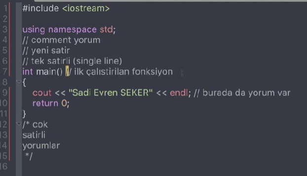
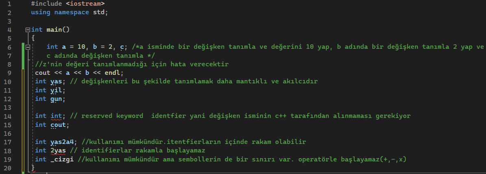
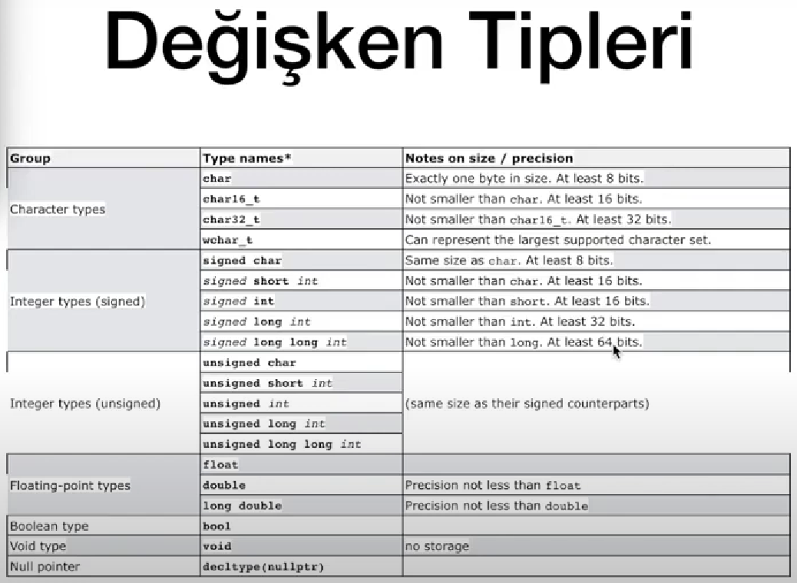
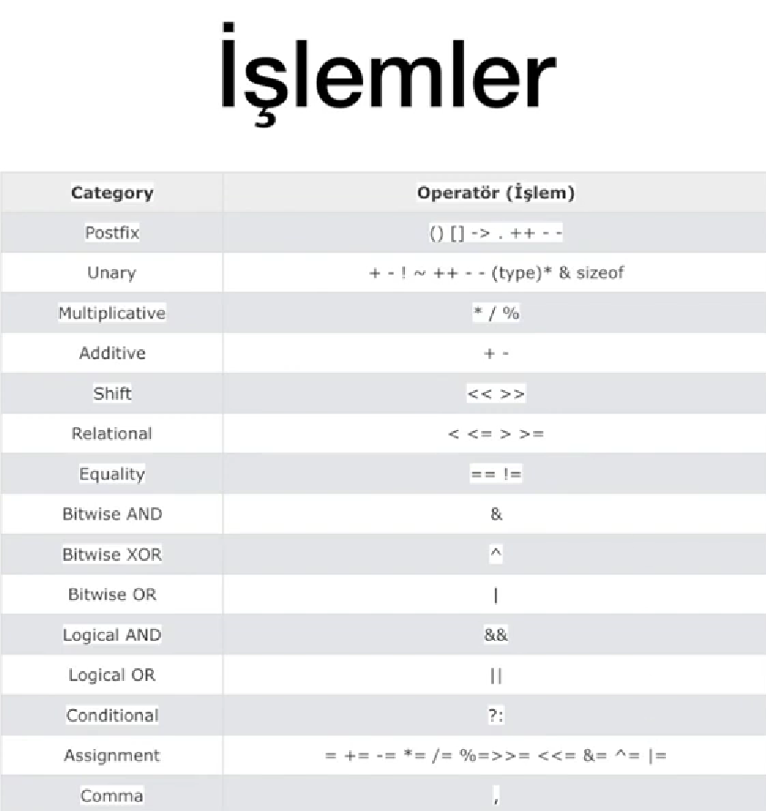
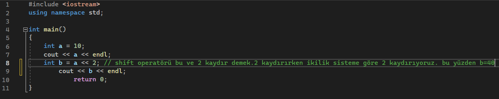
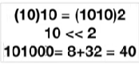
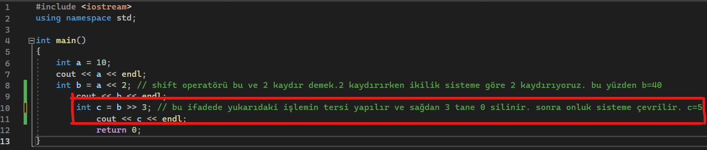
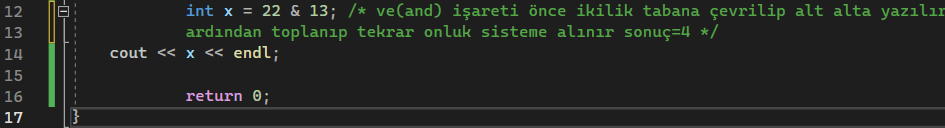
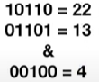
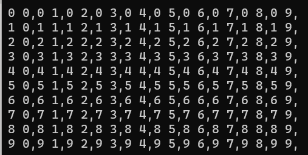

# **C++ Notlarım**

(Son güncelleme: 29/05/2023)

Türkçe c++ notlarıma hoş geldin. C++ notlarımı aktarırken aklına takılan herhangi bir noktayı sormaktan çekinme.

Unutma programlama dilini öğrenmenin en iyi yolu pratik yapmaktır. Öğrendiklerin,gördüğün kodları denemekten çekinme ve sürekli kodla iç içe ol. Kolay gelsin :)

Bu notları c++ programlama dilini öğrenirken aldım.

Öğrendiklerim arasında kendi yorumum bulunmaktadır. 

Bu yüzden yanlış olduğunu düşündüğün bir nokta varsa muhakkak ulaş bana. Hata yapmış olabilirim :)

Her geçen gün yeni bir bilgi öğrendiğimden notlar güncellenebilir :)

- [**C++ Notlarım İçindekiler**](#c-notlarım)
  
  - [Hello World!](#hello-world)
  - [Yorum(Comment) Ekleme](#yorumcomment-ekleme)
  - [Değişkenler(Variables) ve Tanımlama ](#de%C4%9Fi%C5%9Fkenlervariables-ve-tan%C4%B1mlama)
  - [Değişken İsimleri ve Belirleyiciler Identifiers](#değişken-i̇simleri-ve-belirleyiciler-identifiers)
  - [Değişken Tipleri](#değişken-tipleri)
  - [ASCII Tablosu](#ascii-tablosu)
  - [Tip Dönüşümleri](#tip-dönüşümleri)
  - [İşlemler - Operatörler](#i̇şlemler-operatörler)
  - [Temel Giriş ve Çıkış İşlemleri (cin ve cout)](#temel-giriş-ve-çıkış-i̇şlemleri-cin-ve-cout)
  - [İf,Else Ve Else İf Yapıları](#i̇felse-ve-else-i̇f-yapıları)
  - [Switch-Case Yapısı](#switch-case-yapısı)
  - [While Döngüsü](#while-döngüsü)
  - [For Döngüsü](#for-döngüsü)
  - [Dowhile Döngüsü](#dowhile-döngüsü)
  - [Break ve Continue Komutları](#break-ve-continue-komutları)
  - [İç İçe Birden Fazla Döngüler](#i̇ç-i̇çe-birden-fazla-döngüler)
  - [Basit Fonksiyon Yapıları ve Prosedürler](#basit-fonksiyon-yapıları-ve-prosedürler)
  - [Fonksiyonların Değer Döndürmesi ve Çağrılması ](#fonksiyonların-değer-döndürmesi-ve-çağrılması)
  - [Recursive Functions(Özyineli Fonksiyonlar) ](#recursive-functionsözyineli-fonksiyonlar)
  - [Random Number Genarator ](#random-number-genarator)
  - [Arrays(Diziler)](#arraysdiziler)
 

## Hello World

Her satırın sonuna ; koymalısın. C++'da bu satırın bittiğini ifade eder.

#include : belirtilen dosyayı kodun yazıldığı dosya içerisine eklemek için kullanılır. Eğer belirtilen dosya yok ise ekrana bir uyarı mesajı verir.

"< iostream >" : Standart akışlardan okuma ve yazma denetimi sağlayan nesneleri bildirir. Bu genellikle C++ programından giriş ve çıkış yapmak için ihtiyacınız olan tek üst bilgidir.
(kişisel yorum: kütüphanedir ve bazı temel şeyleri yazmamızı sağlar)

[Ekşi Sözlükte yapılan basit bir tanım](https://eksisozluk2023.com/iostream--335972) : input ve output icin include edilen header. yani kullaniciya bir yazi gosterecegimiz zaman yada kullanicidan bir yazi alacagimiz zaman kullaniriz. c++ in hello world orneginde karsimiza cikar. #include using namespace std; void main() { cout << "hello world!" ; }

"cout << "hello world!" ;" satirinda de cout u kullanabilmemiz icin include etmemiz lazimdir. programlamaya basladigim zaman bunun daha basit bir tanimini aradim hello world orneginde. fakat bulamadim. hayatinda ilk defa kod goren birinin anlamadigi bir #include gormesi pek hos degil. simdi benim yapabilecegim en basit tanim budur.


```
#include <iostream> 
using namespace std; 
int main() {
cout << "Hello World!;
reurn 0;
}
```
  ```cout << ''Hello World!'' << endl;``` şeklinde de yazılabilirdi. Endl;; end line yani satır sonu demektir ve ekrana yazdırılan çıktının ardından görüntülenecek veriyi bir alt satırda görüntülemeye yarar. 
  
```return 0;``` satırının genel kabul görmüş manası da "Program hatasız sonlandırıldı" demek oluyor.  

## Yorum(Comment) Ekleme



// kullanılırsa o satır yokmuş gibi hareket edilir. 

Eğer birden fazla satırda sürekli // kullanmak istemiyorsak /* yapıp yorumu bitirmek istediğimizde */ yaparsak oradaki yorum da kodda gözükmez. Yorum olarak kalır. Bazı programlarda /* ifadesinden sonra her satırın başında * olabilir olup olmaması önemli değil. 

 ## Değişkenler(Variables) ve Tanımlama 
```
#include <iostream>
using namespace std;

int main()
{
int a; // tipi integer, ismi a

 a = 10; //değer
// variable degisken olarak da gecer
a = 20  /* atama, assignment. buradaki = matematikteki gibi değil.
Sağdaki değeri al soldakinin içine koy gibi bir tanım mevcut.
ilk önce a'nın içine 10 koyduk sonra 20 koyduk son koyulan değer geçerlidir */;

  cout << a << endl;
  ```
Burada Çıktı 20'dir.
```
#iclude <iostream>
using namespace std;

main()
{
int a = 10, b = 2, z; /* a isminde bir değişken tanımla ve değerini 10 yap, b adında bir değişken tanımla 2 yap ve < adında değişken tanımla */
cout << z << endl; 
  //z'nin değeri tanımlanmadığı için hata verecektir 
  cout << a << b << endl;
  }
  ```

## Değişken İsimleri ve Belirleyiciler Identifiers 



Sembollerden sadece _ ile başlayabilir 

## Değişken Tipleri



Float: Ondalıklı sayı 3.14 

Boolean: 0-1 True-False  

Void:Tipsiz. Ne olduğu bilinmiyorsa kullanılır 

Null: boş 

## ASCII Tablosu


## Tip Dönüşümleri 

**char -> integer : ** 
```
#include <iostream>
using namespace std;

int main()
{
	int a = 10;
	float pi = 3.14;
	long tl = 327462384634783; 
  char b = 'x';
	
	cout << a << endl;
	cout << pi << endl; cout << tl << endl;
	cout << b << endl;
	
	int cc = b;
	cout << cc << endl;

	return 0;
}
```
Terminal :
```
10
3.14
1193085855
x
120
```
120'nin sebebi ASCII Tablosu
Her karakter bir sayıdır. Char'da bahsi geçen harfleri integer'a çevirdiğinden dolayı decimala çevirir.  
X->120 

**float -> integer :** 
```
#include <iostream>
using namespace std;

int main()
{
	int a = 10;
	float pi = 3.14;
	long tl = 327462384634783; 
  char b = 'x';
	
	cout << a << endl;
	cout << pi << endl; cout << tl << endl;
	cout << b << endl;
	
	int cc = b;
	cout << cc << endl;
  
  int ipi = pi;
  cout << ipi << endl; // 3

	return 0;
}
```
Son satırdaki float -> integer dönüşümünde sonuç 3 çıkar.

Normalde pi 3.14 bu yüzden floatla yazdık fakat ipi olarak tanımlarsak ve integer olarak yazarsak ondalıklı kısmını atıp 3 olarak çıkarır.

Kendiniz değer girip uygulama yaparsanız daha etkili sonuç elde edersiniz.
 
 **integer -> float :** 
```
int birsayi= 5;
float sayi2 = birsayi; 
cout << sayi2 << endl; // Sonuç 5 Çıkar
```
**integer -> char :**
```
int sayiint = 37; 
char sayiiyeni = sayiint; 
cout << sayiiyeni << endl; // Sonuç % çıkar
```
Sonucu ASCII tablosundan test et

***KESTİRME BASİT YOL :***
```
int yenisayi = 35; 
 cout << (char) yenisayi << endl; // Sonuç # çıkar
```
İfade edildiği gibi cout <<(int,char,float vb.)identifier << endl; 

Şeklinde daha kısa yazmak mümkün 

Buna *Type casting* denir 

## İşlemler (Operatörler)



**Complement " ~ "** ikilik sistemde 0ları 1 ,1 leri 0 yap demektir. 
```
#include <iostream>
using namespace std;

int main() {

	int a = 10;
	 cout << a << endl; 

	a++; //bir arttır demek posfix
	 cout << a << endl;

	++a; //bir tane daha arttıracağız increment prefix
	 cout << a << endl; //a en son 12 oldu b'yi de 20 diye tamamladık

	int b = 20;
     cout << a + b << endl;
     cout << 10 + 3 * 5 << endl; //işlem önceliği vardır.
	// * + - /
	 cout << 7 % 5 << endl; // remainder, modulo 34 3 4 gibi kalanı ifade eder

	a--; //a'nın değerini bir azalt, a en son 12ydi 11 oldu
    a = a - 1; // ilk derslerde ='in matematiksel olmadığını belirttik. Bu ifade a'ya bir azalt demektir a = 10 olur
    cout << a << endl;

	return 0;
}
```
	
Terminal
```
10
11
12
32
25
2
10
```	
-----------------------------------------------------------

***++a ile a++ kıyası***

```
/* ++a; a++; 
bu iki ifade arasında bu kullanımda fark yok a'nın değeri 12 */

cout << a++ << endl; /* a'nın değeri denkleme alınır 
sonra bir arttırılır yani aslında bu 10u basıp sonra 11 yapıyor o yüzden 10 gözüküyor */

cout << ++a << endl; /* a'nın değeri önce arttırılır sonra denkleme eklenir. 
Yani aslında burada da 11di once 1 arttırıp 12 yapıyor sonra 12 olarak basıyor */ 
//bu iki ifade arasında fark var
```
Terminal 
```
10
10 
12
```

--------------------------------------------------------------

```
int x = 10;
x--;
x = x - 1; // iki ifade aynı hatta tek başına yazılırsa --x de bunlarla aynı 
x -= 1; // bu ifade yukarıda yer alan ifadenin kısaltılmış halidir
x += 6; // x = x+6 demektir
x *= 2; // x = x*2

cout << x << < endl; // Sonuç 26
```

## Left Shift & Right Shift






Iki kaydır demek binary sistemde  aynen yaz sonuna iki 0 ekle demektir. Sonrasında onluk sisteme geri geçilir. 





Right shiftte sonda 0 yoksa diğer basamaklar silinir 





Tabii ki bu örneklerler yetinmemelisiniz. Lütfen sayıları ve [operatörleri](#i̇şlemler-operatörler) değiştirip yeni yeni örnekler yapın. DAha iyi oturacaktır.


## Temel Giriş ve Çıkış İşlemleri (cin ve cout)

***Standart output:*** monitör 

***Standart input :*** klavye olarak düşünülmeli

C input(cin) 

C output(cout) 

```
#include <iostream>
using namespace std;

int main()
{
int x = 10;
cout << x << endl;

cin >> x; // bu komut klavyeden girilen değeri okur
cout << "klavyeden " << x << " degerini girdiniz" << endl; /*türkçe harf kullanma 
Ayrıca kelimelerin bitişik olmaması için sonların ve başlarına boşluk koy */ 
cout << "klavyede girilen degerin 10 fazlasi " << x+10 << " olur" << endl;

return 0;
}
```
Terminal
```
10
70
klavyeden 70 degerini girdiniz
klavyede girilen degerin 10 fazlasi 80 olur
```

## İf,Else Ve Else İf Yapıları 

kod yazarken en çok kullanılan yapılardan biriyle karşı karşıyayız.

# İf yapısı belirli koşula bağlı olarak kodu çıkarmamıza olanak sağlar. Mesela eğer(if) x sayısı 0'dan büyükse bu sayı pozitiftir.
```
#include <iostream>
using namespace std;

int main()
{

int a;
a = 10;
 if (a < 20){ // Boolean TRUE FALSE. Eğer yapısı ile eğer ki a<20 ise sonucu yazacak fakat 20'den büyükse sonucu yazmayacak
cout << "a 20'den kucuk" << endl; }
}
```
a 20'den kucuktur ifadesini yazar.
	
Bu kodu kendiniz deneyip a sayısıyla oynama yapın. a sayısını 20ye eşit ya da büyük yaparsanız ekranda bir şey görmeyeceğinizi test edin.
	
# Else yapısı  şayet değilseyi ifade ediyor. Yani Eğer … değilse o zaman …. 
***Not:*** Else yapısından bahsedebilmemiz için if yapısının kullanılmış olması gerekiyor. Yani aslında if ile bir koşul belirtiyoruz ve o sağlamazsa 
kalan değerler için else geçerlidir diyoruz.
***Önemli NOT : ***  " = " operatörü C dilinde bir değişkene değer atamamızı sağlarken " == " operatörü ise "eşit mi?" koşulunu denetler, eğer değerler eşitse true (1) döndürür, değilse false (0) döndürür. 
" != " operatörü "eşit değil mi" demektir.

a=20 diye bir sayı tanımladığımızı düşünelim. Bu koddan sonra a=10 dersek matematiksel olarak bunun mümkün olmadığı kanısına varız. Fakat c++ için a=10 ifadesi
"assignment" yani atama işlemidir. a=10 ifadesinden sonra a'nın yeni değeri 10 olur.
	

# Else if yapısı eğer değilse … şeklinde açıklanabilir.

Şimdi bir örnek üzerinden if,else if ve else ifadelerine bakalım.
	
```
#include <iostream> 
using namespace std; 
  
int main() 
{ 

int a; 
a = 10; 

 if (a > 20) { // Boolean TRUE | FALSE. Eğer yapısı ile eğer ki a<20 ise sonucu yazacak fakat 20'den büyükse sonucu yazmayacak 
    cout << "a 20'den buyuk" << endl; 
} 

 else if (a == 20) { // bu yapı eğer değilse ... ifadesini ifade ediyor 
    cout << "a 20ye esit" << endl; 
} 
 else if  (a >= 15) { 
    cout << "a 15e esit veya buyuk" << endl; 
} 
else { // bu yapı değilseyi ifade ediyor 
    cout << "a 15'den kucuk" << endl; 
} 

}
```	 
İlk aşamada a'yı 10 olarak tanımladık. 

If yapısı ile eğer a>20 ise "a 20'den buyuk" ifadesini yazdırdık fakat a 20'den küçük olduğu için bu çıkmadı 

Else if yapısı ile eğer a >20 değilse a 20 ye eşit midiri (a==20) tanımladık. Eğer a 20'ye eşit ise "a 20'ye eşit"i çıkaracaktı fakat eşit olmadığından bunu çıkarmadı. 

Sonraki Else if yapısıyla a 15'e büyük eşit midiri sorguluyoruz(a>=15). Eğer a 15e büyük eşitse "a 15e esit veya buyuk" ifadesini çıkaracaktı ama yanlış olduğundan çıkarmadı 

Son Else yapısında eğer bunlar değilse sonuç olarak "a 15den kucuktur" ifadesi ekranımıza çıktı. 
	
Burada unutulmaması gereken noktalardan biri de eğer ifadelerin hepsi false olmayıp true ifadeler de olsaydı ondan sonra gelenleri mantıken çıkarmayacağı. 
Bunun en güzel örneğini sadece a=10 yerine a=20 ifadesini yazmak. Bunu yazıp deneyerek son adıma geçmeden kodun sonuçlanacağını görebilirsiniz.
	
## Switch-Case Yapısı 

 Switch-case yapısı ve if-else yapısı aynı işlevi yerine getirebilir, ancak farklı durumlarda daha uygun olanı tercih edebilirsiniz. İkisi arasındaki tercih genellikle kodun okunabilirliği, sürdürülebilirliği ve karmaşıklığına bağlıdır.
	
```
switch (değer) {
    case durum1:
        // durum1 için yapılacak işlemler
        break;
    case durum2:
        // durum2 için yapılacak işlemler
        break;
    // ...
    default:
        // hiçbir duruma uymayan durumlar için yapılacak işlemler
        break;
}
```
	
	Yapının çalışma mantığı şu şekildedir:

1.```değer``` ifadesi, switch ifadesinin içine yazılan ve karşılaştırılacak olan ifadedir. Genellikle bir değişken veya ifade olabilir.

	
2.Ardından, her bir ```case``` durumu ile karşılaştırma yapılır. Eğer ```değer```, bir ```case``` durumuna eşitse, o duruma ait olan kod bloğu çalıştırılır. Çalıştırılan kod bloğunun sonunda ```break``` ifadesi bulunur, bu sayede diğer durumlar kontrol edilmez ve switch-case yapısından çıkılır.

		
3.Eğer ```değer```, hiçbir ```case``` durumuna eşit değilse, ```default``` durumu (opsiyonel olarak kullanılır) çalıştırılır. Bu durum, hiçbir ```case``` durumuna uymayan durumlar için kullanılır. ```default``` durumu, switch-case yapısında en sona yazılır.

	
4.``break``` ifadesi, her bir ```case``` bloğunun sonunda bulunmalıdır. Bu, programın diğer durumları kontrol etmeksizin switch-case yapısından çıkmasını sağlar.

	
Switch-case yapısı, birçok durumu kontrol etmek ve farklı işlemler gerçekleştirmek için kullanışlıdır. Özellikle belirli değerlere göre yapılan işlemlerde if-else yapısından daha okunabilir bir seçenek sunabilir. Ancak, switch-case yapısı yalnızca sabit ifadelerin kontrolü için kullanılabilir ve karşılaştırma yapılacak ifadenin tam olarak belirlenmesi gerekmektedir.

	
## While Döngüsü

Döngüler, belirli bir işlemi tekrar tekrar gerçekleştirmek için kullanılan kontrol yapılarıdır. Döngüler, belirli bir koşul sağlandığı sürece belirli bir kod bloğunu tekrarlayarak çalışırlar.

```
#include <iostream> 
using namespace std; 

int main() { 
int a; 
a = 1; //ilk değer , initialization 

while (a<10) { 
cout << "merhaba" <<a<< endl; 
a++; // whil(a<10) sayesinde sürekli arttırken 9da duracaktır  
} 

	return 0; 
} 
```
Terminal 
```
merhaba1
merhaba2
merhaba3
merhaba4
merhaba5
merhaba6
merhaba7
merhaba8
merhaba9
```
	
## For Döngüsü
	
For yapısı ile ilk değer,koşul ve adım sayısı değelerini tek satırda hallediyoruz. 
	
```
#include <iostream> 
using namespace std; 

int main() { 

for (int i = 1; i < 11; i++) 
cout << i << "hi" << endl; 

	return 0; 
} 	
```
Terminal

```
1hi
2hi
3hi
4hi
5hi
6hi
7hi
8hi
9hi
10hi
```
			 
## Dowhile Döngüsü

***Önemli:*** Dowhile'ın while ve for dönülerinden farkı önce çalıştırır sonra döngüyü başlatır. 
Örneğin 
```
int a = 100;
int i = 100;

do {
    // Kod bloğu
    i++;
} while (i < a);
```
Yukarıdaki örneği diğer 2 döngüde deneseydik çalıştırmazdı fakat dowhile döngüsünde bir kereye mahsus çalıştırır.
----------------------------------------------------------------------------------------------------	
```
#include <iostream> 
using namespace std; 

int x = 1; 

do { 
 cout << "eyup ece" << x << endl; 
 x = x * 3; 
}while(x < 10); 

  return 0; 
} 	
```
Terminal
```
eyup ece1
eyup ece3
eyup ece9
```

## Break ve Continue Komutları 

Break kırıp devamını getirmezken continue atlayıp devamını getiriyor 

```	
#include <iostream> 
using namespace std; 

int main() { 

for (int i = 0; i < 10;i++) { 
if (i == 5) 
break; 
cout << i << endl; 
} 

  return 0; 
} 
```
ifadesinde terminalde 1,2,3,4 ifadeleri yazılıp sonlanırken

```
#include <iostream> 
using namespace std; 

int main() { 

for (int i = 0; i < 10;i++) { 
if (i == 5) 
continue; // break kırıp devamını getirmezken continue atlayıp devamını getiriyor 
cout << i << endl; 
} 
 
  return 0; 
} 
```
ifadesinde 1,2,3,4 ve 5 atlanıp 6,7,8,9 ifadeleri ekranda çıktı olarak yer alır

	
## İç İçe Birden Fazla Döngüler	

```	
#include <iostream> 
using namespace std; 
	
int main() { 
	
for (int i = 0; i < 10; i++) { 
 for (int j = 0; j < 10; j++) { 
    cout << i << " " << j << ","; 
  } 
  cout << endl; 
} 
	return 0; 
} 
```

	
## Basit Fonksiyon Yapıları ve Prosedürler 

***Bir Kod Bloğunun Koşula Bağlanmasını ```if``` ile yapmıştık***

***Bir kod bloğunun tekrar edilmesini ```döngülerle ``` yapmıştık***

Şimdi de 
	
***Bir kod bloğunun parametrize edilmesini konuşacağız.***
	
Bu işlemi yapmamızın birden fazla nedeni var.

İlk olarak [ChatGpt](https://chat.openai.com/)'nin yanıtıyla başlayalım
			
1-)Verilerin gruplanması: Diziler, benzer türdeki verilerin gruplanmasını sağlar. Bir fonksiyon, belirli bir veri kümesiyle çalışmak için bir dizi parametresi alabilir. Bu, bir dizi içindeki tüm verileri tek bir parametre ile fonksiyona iletebilmenizi sağlar.

2-)Bellek verimliliği: Diziler, ardışık bellek bloklarında depolanır. Bir fonksiyon, bir dizi parametresi alarak, bellekteki verilere doğrudan erişebilir. Bu, her bir veri elemanının ayrı ayrı kopyalanmasına veya aktarılmasına gerek kalmadan veriye erişimi hızlandırır ve bellek kullanımını optimize eder.

3-)Genel kullanılabilirlik: Bir fonksiyonun dizi parametreleri alması, aynı fonksiyonun farklı boyutlardaki dizilerle çalışabilmesini sağlar. Örneğin, bir sıralama işlevi, farklı boyutlardaki dizileri sıralamak için aynı kodu kullanabilir. Bu, kodun yeniden kullanılabilirliğini artırır ve işlevin daha genel bir kullanım alanına sahip olmasını sağlar.

4-)İşlevsellik: Dizi parametreleri, fonksiyonlara veri manipülasyonu veya dizi üzerinde yapılan diğer işlemler için daha fazla işlevsellik sağlar. Örneğin, bir fonksiyon, dizi parametresi üzerinde bir döngü kullanarak tüm elemanları dolaşabilir ve her bir eleman üzerinde belirli bir işlem gerçekleştirebilir.

5-)Hafıza paylaşımı: Dizi parametreleri, bellekteki verilerin paylaşılmasını sağlar. Bir fonksiyona bir dizi geçirildiğinde, aslında bellekteki aynı verilere işaret eden bir referansın kopyası geçirilir. Bu, bellek kullanımını azaltır ve veri kopyalamasıyla ilgili maliyeti düşürür.

İkinci olarak da;
			 
Bir fonksiyon kullanarak bir dizinin tüm elemanlarını döngü ile işlemek, tekrarlayan kodları azaltır ve daha temiz bir yapı oluşturur.

```
#include <iostream> 
using namespace std; 

int fonks(int x) { 
cout << x*2  << endl; 
return x * 2; 
} 

int main() { 

fonks(10); 
fonks(20);
	
	return 0; 
} 
```
Terminal
```
20
40
```
f fonksiyonunda return kullanmamızın sebebini [ChatGpt](https://chat.openai.com/) şu şekilde açıklıyor:

Bu C++ kodunda herhangi bir derleme hatası yok, ancak fonks fonksiyonunun int dönüş türüne sahip olmasına rağmen, fonksiyon sonunda bir return ifadesi yok. Bu nedenle, fonks fonksiyonu herhangi bir değer döndürmez. Eğer fonksiyonun bir değer döndürmesi gerekiyorsa, return ifadesi fonksiyon sonunda eklenmelidir. 

int gibi bir değer dönüş türü belirtilmişse, fonksiyonun bir değer döndürmesi gerekir. return ifadesi, fonksiyonun sonunda, döndürmek istediğimiz değeri belirtmek için kullanılır. Eğer bir değer döndürmeyi unutursak, program davranışı tanımsız olur. C++ standartlarına göre, böyle bir durumda programın davranışı belirsizdir ve hata vermesi gerekmeyebilir.  

 ## Fonksiyonların Değer Döndürmesi ve Çağrılması 
```	
#include <iostream> 
using namespace std; 

int f(int x) { 

cout << x  << endl; 

return 5; 
} 

int main() { 

cout << f(10) << endl; 
cout << f(20) << endl; 
f(35); 
	
return 0; 
} 
```
Terminal
```
10
5
20
5
35
```
	
Yazdığımız kodun açıklaması şu şekilde:
	
Ana fonksiyonumuz main fonksiyon olduğu için direkt ona geçiyoruz.  
	
f() fonksiyonu çağrıldığında, önce cout << x << endl; ifadesi çalışır ve x değeri ekrana yazdırılır. 
Ardından return 5; ifadesi ile f() fonksiyonu sonlandırılır ve 5 değeri çağrıldığı yere döndürülür. 

main() fonksiyonunda ise, önce f(10) çağrısı yapılarak 10 değeri ekrana yazdırılır ve f() fonksiyonu 5 değeri ile sonlandırılır. Sonra cout << f(10) << endl; ifadesi çalıştırılarak, f(10) fonksiyonunun döndürdüğü 5 değeri ekrana yazdırılır. 

Aynı şekilde f(20) çağrısı da yapılarak önce 20 değeri ekrana yazdırılır ve f() fonksiyonu 5 değeri ile sonlandırılır.
Sonra cout << f(20) << endl; ifadesi çalıştırılarak, f(20) fonksiyonunun döndürdüğü 5 değeri ekrana yazdırılır. 

Son olarak, f(35) fonksiyonu çağrılır ve sadece 35 değeri ekrana yazdırılır. 
Fonksiyon sonunda return ifadesi olmadığından, fonksiyon sonlandığında herhangi bir değer döndürülmez. 
	
	
 ## Recursive Functions(Özyineli Fonksiyonlar)
	
BÜTÜN iterative(döngü) fonksiyonlar Recursive, BÜTÜN recursive fonksiyonlar iterative yazilabilir. 

Recursive fonksiyonlar, kendilerini çağıran ve bir sorunu küçük alt sorunlara bölerek çözen fonksiyonlardır. Yani, bir fonksiyon içerisinde kendisiyle tekrar tekrar çağrılar yaparak işlemi gerçekleştirir.
	
Recursive fonksiyonlar, problemleri parçalara ayırarak daha küçük ve daha yönetilebilir alt sorunlara dönüştürür. Her alt sorun, aynı fonksiyonu tekrar çağırarak çözülür. Alt sorunlar çözüldükten sonra, sonuçlar birleştirilerek orijinal sorunun çözümü elde edilir.
	
```
#include <iostream> 
using namespace std; 

/* 
factorial(4) = 4 * factorial(3) 
factorial(3) = 3 * factorial(2) 
factorial(2) = 2 * factorial(1) 
factorial(1) = 1 
*/ 
	
//özyineli(recursive) fonksiyonlar bir ifadeyi yine kendi biçiminde ifade etme işidir.  
// ilk başta koşulu yani n'in 1 olma durumunda 1 olmasını belirleyip ardından yukarıdaki tabloda adım adım ilerliyoruz. 
//önce factorial(4) ifadesini yerine koyuyoruz sonrasında diğer factorial terimleri bulup en son 1de yerine koyduğumuzda işlemi buluyoruz. 

int fact(int n) { 
if (n == 1) 
return 1; 
return n * fact(n - 1); 
} 
 
int main() { 
int sayi; 
cin >> sayi; 
cout << fact(sayi) << endl; 

return 0; 
} 
```
	
burada parça parça ilerleyip aslında n! = n . (n-1)! metodundan faydalanıyorsun ve en sonunda 1e ulaşında işlemi noktalıyoruz.

***NOT :***

Return ifadesini çalıştırırsa sonrasını çalıştırmaz 
O yüzden 

```
int fac(int n) { 
if (n == 1) 
return 1; 
//Else.....  Burada else yazılmasına gerek yoktur. Zaten return 1 i çalıştırırsa sonrasını yazdırmaz 
} 
```
 "return" ifadesi çalıştığında, fonksiyon o noktada sonlanır ve geri döner. Dolayısıyla, "return" ifadesi çalıştığında sonrasındaki kod bloğu veya ifadeler çalıştırılmaz. Bu nedenle, bir fonksiyonda "return" ifadesi kullanıldığında, "else" veya başka bir şart kontrol bloğu yazmanıza gerek yoktur.
	

 ## Random Number Genarator
```
#include <iostream> 
using namespace std; 
  
int main() { 
int rg; 
srand(time(NULL)); // seed(tohum-besleme) 
rg = rand(); 
cout << rg; 

return 0; 
} 	
```	

	
Bu kodda üretilen rasgele sayılar, rand fonksiyonunun ürettiği 0 ile RAND_MAX (C++ standardına göre minimum 32767) arasındaki tam sayı değerleridir. Ancak, bu rasgele sayılar daha sonra modulo (%) işlemine tabi tutulduğunda, 10'un üssüne göre hesaplanmış bir değere dönüştürülecektir. 

Yani, cout << rg % 100000; ifadesi, 0 ile 99999 arasındaki tam sayıları üretir ve ekrana yazdırır. Bu nedenle, ekrana yazdırılan sayı en fazla 5 basamaklı olabilir. 

Eğer daha fazla basamaklı bir sayı elde etmek istiyorsanız, rg % (10^k) şeklinde bir işlem yapabilirsiniz, burada k istediğiniz basamak sayısıdır. Örneğin, cout << rg % 1000000; ifadesi 0 ile 999999 arasındaki tam sayıları üretecektir. 
	
[Zar Atma Programı](https://github.com/eyupece/cpp-my-projects/blob/main/Rolling%20the%20dice.cpp) ile random number genaratorun mantığını daha net anlayabilirsiniz.

## Arrays(Diziler)
	
Kullanılan çoklu veri elemanlarını depolamak için kullanılan veri yapılarıdır. 
Bir dizi, aynı türden birden çok öğeyi bellekte ardışık olarak saklar.
Köşeli parantez şarttır.
	

	
```	
#include <iostream> 
using namespace std; 

int main(){ 
  
	int a[4] = { 1, 9, 0, 5 }; 

           cout << a[0] << endl; // 1 görmeyi bekliyoruz  
           cout << a[1] + a[3] << endl; // 14 görmeyi bekliyoruz 
           cout << a[2] - a[3] << endl; // -5 görmeyi bekliyoruz 

  a[1] = 4; 

       cout << a[1] << endl; // normalde a[1] 9du fakat önceki satırda 4 diye tanımladığımız için artık 4 

   for (int i = 0; i < 4; i++) { 
   	cout << a[i] << endl; // sırayla yazıyor 
   } 

   	int b[2]; // burada da kullanıcıdan girilmesini sağlıyoruz 

   	cin >> b[0] >> b[1]; 

   for (int j = 0; j < 2; j++) { 
  	 cout << b[j] << endl; 
   } 

return 0; 
} 
```
